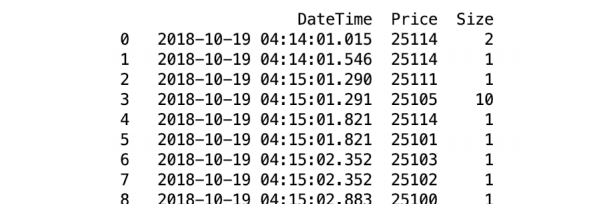
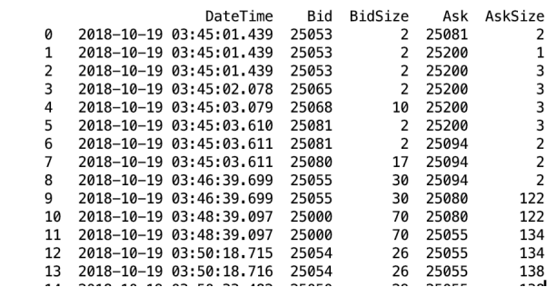
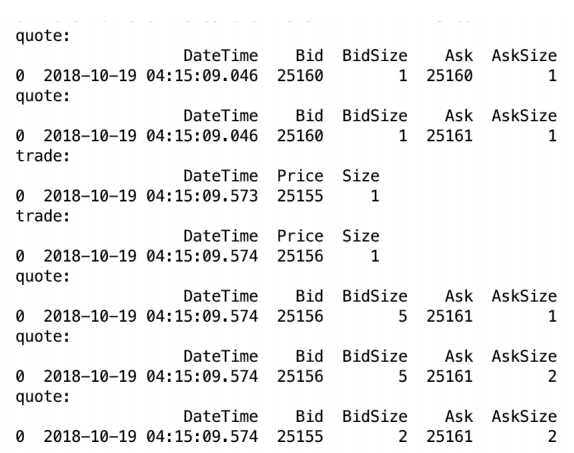

# **Тестовое задание**

>Задача ‒ рассчитать индикаторы на базе двух входящих потоков данных, хранящихся в
>файле. Необходимо организовать код так, чтобы это было похоже на имитацию
>потребления данных в реальном времени, чтобы в последующем источник данных вы
>могли бы заменить - например, внешний фид по API вместо файлов.
>
>
>Постарайтесь сделать так, чтобы программа не потребляла слишком много памяти, не
>загружала весь объем данных в память, а поточно обрабатывала их.
>Исходные данные: quotes, trades в csv файлах.


Исходные файлы: [**HSI.Quote.csv**](https://drive.google.com/file/d/1ujhWC9gkScbqxcg-kDUcehQ_A0ZMX4vU/view?usp=sharing) и [**HSI.Trade.csv**](https://drive.google.com/file/d/1oB_sCBdUeklOafRpwSPY3URcgB1A8_on/view?usp=sharing)


Столбцы в Quotes: DateTime (момент появления нового состояния top of the book), Bid
(цена бида), BidSize (объем на биде), Ask (цена аска), AskSize (объем на аске)
Столбцы в Trades: DateTime (момент сделки), Price (цена сделки), Size (объем сделки).


>UPD (15 марта 2019): Для того, чтобы создать имитацию течения времени, следует
>придерживаться правила, что если Вы считали некую запись с временем DateTIme = t1, 
>то вы к этому моменту вы не считывали никаких записей с DateTime > t1, как из Trades,
>так и из Quotes.

>
>Вам нужно посчитать индикатор **y = mid_weighted - VWAP** и сохранить его в файл.
>
>**mid_weighted** – это “взвешенная мид-цена”. В то время, как на бирже **bid** и **ask** цены
>являются дискретными с шагом один тик, это – непрерывный показатель.
>
>**mid_weighted = (Bid * AskSize + Ask * BidSize) / (BidSize + AskSize)**


>UPD (15 марта 2019):
>Запись y нужно сохранять в файл только на приходящие записи (события) Quote.
>Это связано с особенностью реальных данных. После каждого Trade обновляется
>“стакан” и должна прийти новая запись Quote. Эта же особенность указывает нам на то,
>что при наличии записей с одинаковым временем в двух файлах, в первую очередь
>должны быть обработаны записи Trade.
>
>VWAP – это взвешенная по объему средняя цена.
>VWAP можно посчитать для торгового дня в целом, с начала дня, или в окне.
>Для данной задачи Вам нужно использовать окно размером в 1000 контрактов. 


>UPD (15 марта 2019):
>Например, если последние сделки были [{время:1, объем:300, цена 100}, {время: 2,
>объем:700, цена 90}, {время:3, объем:200, цена: 70}], то VWAP будет **(100 * 100 + 700 * 90 +
>200 * 70) / 1000**. Окно "прорежет" наиболее дальнюю во времени запись на части,
>поэтому мы из дальней записи берем объем 100, а не 300. Учитывайте, что окно
>сдвигается с каждой новой сделкой в фиде - в него включаются новые наблюдения и
>исключаются старые.

Последнюю часть я не очень поняла, поэтому делить значения дальних записей не стала.

>Справочные материалы (для тех, кто не знаком с предметной областью):
>
>https://en.wikipedia.org/wiki/Order_book_(trading)
>
>https://en.wikipedia.org/wiki/Volume-weighted_average_price
>
>https://www.youtube.com/channel/UC3HKlZ_7gxRgef9SCxu54Lw (канал Bookmap)


## Заголовки таблиц
Содержимое первого файла:





Содержимое второго файла:




## Имитация времени при обработке файлов

Имитация времени заключается в последовательном считывании записей из файлов. Если trade_time > quote_time, то мы обрабатываем quote и считываем оттуда новую запись, иначе считываем и обрабатываем trade.

_Фрагмент кода из main.cpp_
```C++
    do
    {
        if (trade > quote)
        {
            y = quote.getMidWeighted() - trade.get_vwap();
            
            write   << quote.getDate()  << "," << quote.getMidWeighted() << ","
            << trade.get_vwap() << "," << y << endl;
            quote.nextRecord();
            
        }
        else
        {
            trade.nextRecord();
        }
        
    } while (quote.checkStream() && trade.checkStream());
```

Вывод записей после "упорядочивания":



## Обработка записей

Было решено не пересчитывать многократно сумму значений внутри "коридора" из 1000 записей, а просто прибавлять значение следующей записи и вычитать ту, что из этого коридора вышла.
Таким образом, сложность вычислений в этом фрагменте минимальна.

Для читаемости и простоты кода были перегружены операторы > и <=, которые в данной реализации сравнивают время записей.
Этого удалось достичь за счет родительского класса Event, содержащего так же общую для Quote и Trade часть: открытие файла, проверка потока и запрос времени.

В начале обработки заявок окно в 1000 записей еще не заполнено, поэтому были использованы только те записи, что уже есть.
Для соответствия требованиям задачи изначально значение vwap было первым из файла.

Файл с результатами так же прикреплен.
